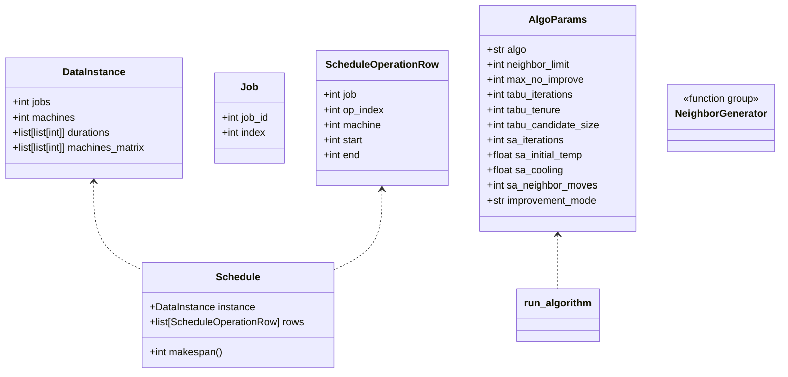

## Architecture Overview

High‑level goals: keep a small, testable core for JSSP metaheuristics while
separating experiment *modes* (CLI orchestration, batching, artefact output)
from reusable algorithmic components (decoding, neighborhoods, search).

### Module Map

```
src/
  main.py                # CLI entrypoint; parses args and dispatches modes
  models.py              # Core immutable data classes (DataInstance, Schedule)
  parser.py              # Taillard instance parsing (normalizes 1->0 based)
  operations.py          # Base permutation construction + validation
  decoder.py             # Serial schedule generation + random/SPT permutations
  neighborhood.py        # Feasible move operators (swap/insert) + generator
  search.py              # Metaheuristics: evaluate cache, hill, tabu, SA
  visualization.py       # Gantt + progress scatter plots (lazy matplotlib)
  modes/
    common.py            # AlgoParams dataclass + uniform run_algorithm helper
    auto.py              # Independent multi-start (single instance) logic
    benchmark.py         # Batch multi-instance benchmarking logic
  __init__.py            # Package exports (DataInstance, Job, parse_taillard_data)
tests/                   # Unit tests (parsing, decoding, moves, algorithms)
research/                # (Git-ignored) benchmark artefacts (JSON + PNG)
charts/                  # (Git-ignored) auto mode artefacts
```

### Data Flow

1. `parser.load_instance` -> `DataInstance` (jobs matrix)
2. Permutations (`list[tuple[job, op]]`) feed `decoder.build_schedule_from_permutation`
3. Metaheuristics in `search` manipulate permutations using neighbors from
   `neighborhood.generate_neighbors` (which itself uses `swap_*` / `insertion`).
4. Schedules are visualised via `visualization.plot_gantt`; algorithm progress
   via `plot_progress_curves`.
5. Modes (`auto`, `benchmark`) coordinate repeated algorithm runs using
   `modes.common.run_algorithm` to avoid code duplication.

### Flow Charts (Mermaid)

Ogólny przepływ pojedynczego uruchomienia algorytmu (CLI -> wynik):

```mermaid
flowchart LR
  A[CLI args \n main.py] --> B{Tryb}
  B -->|--instance + --algo| C[load_instance \n parser.load_instance]
  C --> D[Heurystyki startowe \n decoder.random_permutation / spt]
  D --> E[Wybrana permutacja startowa]
  E --> F{Algorytm \n hill/tabu/SA}
  F -->|iteracje| G[generate_neighbors \n neighborhood]
  G --> H[evaluate(permutation) \n search.evaluate \n (cache Schedule)]
  H --> I{Lepsze?}
  I -->|tak| E
  I -->|nie| F
  F -->|koniec kryterium| J[Best permutation]
  J --> K[decoder.build_schedule_from_permutation]
  K --> L{--gantt?}
  L -->|tak| M[visualization.plot_gantt]
  L -->|nie| N[(Zakończenie)]
  M --> N
```

Przepływ w trybie `auto` (wielokrotne niezależne starty):

```mermaid
flowchart TB
  A[Auto mode start] --> B[Loop runs (N)]
  B --> C[Utwórz RNG z seed+offset]
  C --> D[Wylosuj heurystyki + start]
  D --> E[Uruchom run_algorithm]
  E --> F[Zapis częściowych wyników JSON]
  F --> G{Koniec N?}
  G -->|nie| B
  G -->|tak| H[Selektuj najlepszy wynik]
  H --> I[Zapis final JSON + (opcjonalnie) wykresy]
```

Tryb `benchmark` (instancje * m powtórzeń):

```mermaid
flowchart LR
  A[benchmark.py] --> B[Enumeracja / losowanie instancji]
  B --> C[For each instance]
  C --> D[For each algo / param set]
  D --> E[Wielokrotne uruchomienia (run_algorithm)]
  E --> F[Inkrementalny zapis JSON (temp->replace)]
  F --> D
  D -->|kolejna instancja| C
  C -->|koniec| G[Agregacja / statystyki]
```

### Diagram klas (Mermaid)



Notatki:
* `Job` może być reprezentowany uproszczonym tuple / strukturą; diagram pokazuje semantykę.
* `NeighborGenerator` symbolicznie reprezentuje zestaw funkcji w `neighborhood.py`.
* `evaluate` nie tworzy osobnej klasy – działa funkcyjnie z cache (dict) powiązanym lokalnie z biegiem algorytmu.

### Key Design Choices

* **Immutable data classes**: `DataInstance` / `Schedule` are frozen dataclasses
  enabling safe sharing across functions.
* **Explicit permutation validation**: `operations.validate_permutation` is
  only invoked when needed (tests / debug) to keep hot loops lean.
* **Single responsibility**: Each module owns one conceptual layer (parsing,
  decoding, neighbor generation, search, orchestration, visualization).
* **Isolation of mode orchestration**: Heavy experiment logic extracted from
  `main.py` into `modes/` modules for clarity and reusability.
* **Atomic incremental writes**: Benchmark mode writes `results_incremental_*.json`
  using a temp + replace strategy to survive interruption.
* **Pluggable RNG**: All stochastic functions accept an injected `random.Random`
  allowing reproducibility via `--seed`.
* **Jednolite absolutne importy**: Kod wewnętrzny używa formy `from src.*` (usunięto
  wcześniejsze fallbacki i relatywne aliasy), co upraszcza narzędzia typu mypy
  oraz eliminuje dwuznaczność przy instalacji pakietu w środowisku wirtualnym.

### Error Handling Philosophy

* Core algorithmic functions raise exceptions on structural issues (e.g.
  invalid permutation) to surface programmer errors early.
* Modes catch broad exceptions only around IO / plotting to continue processing
  other runs or instances while logging warnings.

### Extensibility Notes

* To add a new metaheuristic: implement it in `search.py` (or a new module),
  extend `AlgoParams` if new hyper-parameters are required, and hook it into
  `run_algorithm` plus the lists in `auto.py` / `benchmark.py`.
* To add a new batch mode: create a module under `modes/` reusing
  `AlgoParams` + `run_algorithm` for consistency.
* To integrate alternative instance formats: add a parser and dispatch by file
  signature or CLI flag; keep `DataInstance` as the normalized in-memory form.

### Type Hints & Tooling

Project uses strict-ish typing (`mypy`), linting (`ruff`) and formatting (`black`).
Optional deps group `dev` installs tooling: `pip install .[dev]`.
Parser uproszczono (usunięto blok try/except dla importów); struktura pakietowa
jest wymagana (`import src.parser`).

Test coverage (stan bieżący):
* Parsing: poprawne / błędne przypadki.
* Permutacje i dekoder (różne walidacje + naruszenia precedencji).
* Sąsiedztwa: każdy operator + generator.
* Metaheurystyki: evaluate cache, hill climb (obie strategie), tabu, SA (w tym early stop).
* Auto mode: generacja JSON, deterministyczność przy seed.
Brak jeszcze testów CLI (`main.py`), pipeline, benchmark i wizualizacji.

### Performance Considerations

Current implementation optimises for readability; hotspots (evaluate & neighbor
generation) are pure Python but small enough for moderate instance sizes.
Potential future optimisations: vectorised duration calculations, Cython for
decoder, heuristic pruning in neighborhood sampling, oraz cache dla wyboru
czynności na maszynach.

### Licensing

MIT license (see `LICENSE`).

---
Feel free to adapt or extend this architecture section as research evolves.